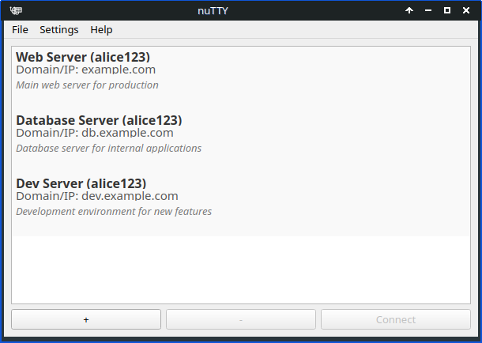
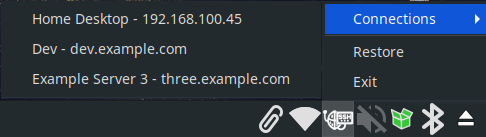

# nuTTY SSH Manager
nuTTY is a work-in-progress, designed to be a simple, user-friendly SSH and Telnet session manager for Linux. It helps you manage your SSH and Telnet connections (Note: Telnet support is not fully tested yet) and allows you to connect to remote servers easily using your preferred terminal emulator.

nuTTY includes a system tray icon for quick access and the ability to minimize to the tray, providing a seamless experience while managing multiple connections. **Please note that nuTTY does not package any terminal emulator**; it relies on terminal emulators already installed on your system. **Supported emulators must be available in your PATH for nuTTY to work properly**.
Project Intent:

This project is not intended to be a highly polished or serious project. I primarily created it to address my own personal needs. While I'm happy to share it with others, I will only continue adding significant features and improvements if there is clear interest from the community.

That said, I do plan to include an **AppImage** release with limited functionality in the near future, so it can be easily tested or used without needing to manually install dependencies.

## Current Limitations:

- **Identity file and password support**: These features are not yet implemented. As of now, nuTTY has been tested only with preexisting connections where SSH keys have already been exchanged. Full support for identity files and password-based authentication will be added and tested soon.

- **Terminal emulator support**: Currently, only a few terminal emulators are supported. Testing has been performed with GNOME Terminal and XFCE Terminal, but support for more emulators will be added in future releases.

There are only a few terminal emulators supported so far, and I have only tested connections with gnome-terminal and xfce4-terminal.  
<table>
<tr>
<th colspan="2">Terminal Emulators that have been implemented and **might** work</th>
</tr>
<tr><td>XTerm</td><td>Alacritty</td></tr>
<tr><td>GNOME Terminal</td><td>Kitty</td></tr>
<tr><td>Konsole</td><td>URxvt</td></tr>
<tr><td>XFCE Terminal</td><td>st</td></tr>
<tr><td>LXTerminal</td><td>Eterm</td></tr>
<tr><td>Tilix</td><td>Mate Terminal</td></tr>
</table>

## Features

- **SSH and Telnet Session Management**: Easily add, edit, and remove SSH and Telnet connections.
- **Custom Terminal Emulators**: Choose from a variety of terminal emulators to launch your SSH sessions.
- **Connection Encryption**: All saved connections are encrypted using `cryptography` to ensure the security of your data.
- **System Tray Integration**: nuTTY can minimize to the system tray and restore when needed. Supports double-click activation from the tray icon.
- **Custom Connection Settings**: Add detailed connection settings including:
  - Username
  - Hostname or IP address
  - Protocol (SSH, Telnet)
  - X11 forwarding
  - Description for each connection
- **Encrypted Storage**: Securely save all your connections in an encrypted file.

## Screenshots




## Installation

1. **Clone the Repository**:

```bash
git clone https://github.com/mikeisfreeman/nuTTY.git
cd nutty-ssh-manager
```


2. **Create a Python Virtual Environment (Optional but Recommended)**:

```bash
python3 -m venv venv
source venv/bin/activate
```

3. **Install Dependencies**:

```bash
pip install -r requirements.txt
```

4. **Run the Application**:

```bash
python3 main.py
```

## Usage

1. **Add a Connection**: Click on the "+" button to add a new SSH or Telnet connection. Enter the required details (username, domain/IP, protocol) and optionally configure X11 forwarding and provide a description.
2. **Connect to a Server**: Select a connection from the list and click the "Connect" button to open the terminal and start an SSH or Telnet session.
3. **System Tray**: nuTTY minimizes to the system tray. You can restore it by double-clicking the tray icon. From the tray, you can also restore or exit the app.
4. **Terminal Emulator Selection**: Use the Emulator menu to select your preferred terminal emulator for launching SSH or Telnet sessions.

## Customization

- **Custom Terminal Emulators**: You can choose from a variety of terminal emulators, such as XTerm, GNOME Terminal, Konsole, XFCE Terminal, and more. Simply go to the Emulator menu and select your preferred emulator.
- **Start on Boot**: You can set up nuTTY to start automatically on boot by adding the provided .desktop file to your system's startup applications.
- **Configuration File**: nuTTY saves your preferences in config.json and securely encrypts your saved connections in connections.dat.

## Development

If you wish to contribute or modify the application, feel free to fork the repository or submit a pull request.

## Contributing

Contributions are welcome! 


## License

nuTTY is open-source software licensed under the MIT License. See the LICENSE file for more information.


### Acknowledgments

Special thanks to all contributors and users who have or will provided feedback and suggestions to make nuTTY a better tool for managing SSH sessions.

Author: Mike<br />
Version: 0.1.2<br />
Repository: [[nuTTY](https://github.com/mikeisfreeman/nuTTY)]


<br /><hr /><br />
## AppImage Build Instructions

Steps for packaging as an AppImage:
1. **Install Required Packages**

First, you need to ensure that you have the required tools installed for packaging your app. You will need:

```bash
pip install pyinstaller
```

2. **Download** the linuxdeploy tool:

```bash
wget https://github.com/linuxdeploy/linuxdeploy/releases/download/continuous/linuxdeploy-x86_64.AppImage
chmod +x linuxdeploy-x86_64.AppImage
```

3. Compile Your PyQt5 Application Using PyInstaller

You’ll need to compile the app into a single executable. PyInstaller packages Python programs into standalone executables.

Run the following command to package the application:

```bash
pyinstaller --onefile --noconsole --name nuTTY main.py
```
**Explanation of the flags**:

--onefile: This creates a single executable file.
--noconsole: This ensures no console window opens (important for GUI applications).
--name NuTTY: This sets the name of the resulting executable as "NuTTY".
main.py: This is the entry point Python file.

After this, PyInstaller will generate the binary in the dist/ directory.

3. Organize the Files for Packaging

Create a directory to hold the application resources:

``` bash
mkdir AppDir
mkdir -p AppDir/usr/bin
cp dist/NuttyApp AppDir/usr/bin/
```

If you have additional resources, such as the tray icon image, you can place them into appropriate folders, *e.g., AppDir/assets/icons/*.

4. Create a Desktop Entry

Create a .desktop file in the AppDir directory to define the application metadata:

```bash
mkdir -p AppDir/usr/share/applications/
nano AppDir/usr/share/applications/NuttyApp.desktop
```

Here’s an example .desktop file:

```ini
[Desktop Entry]
Name=Nutty SSH Manager
Exec=NuttyApp
Icon=nutty-icon
Type=Application
Categories=Network;Utility;
```

Make sure the Icon refers to the name of the tray icon (e.g., nutty-icon.png), and place the icon in *AppDir/assets/icons/.*

5. Use linuxdeploy to Create the AppImage

Now, use linuxdeploy to bundle everything into an AppImage:

```bash
./linuxdeploy-x86_64.AppImage --appdir AppDir --output appimage
```

This will package the contents of the AppDir folder and generate an AppImage file in the current directory.

6. Test the AppImage

Once the AppImage is created, you can run it to test that it works:

```bash
./NuttyApp-x86_64.AppImage
```

_**Optional**: Add Start-on-Boot Feature (for Linux)_

If you want the app to start on boot, you can add a .desktop file to the autostart directory (~/.config/autostart/).

Example:

```bash
mkdir -p ~/.config/autostart
cp AppDir/usr/share/applications/NuttyApp.desktop ~/.config/autostart/
```

This should provide you with a portable AppImage that can run on almost any Linux distribution without needing to install dependencies.
